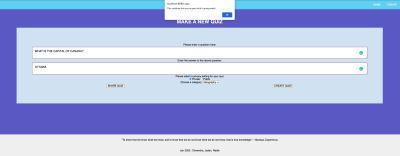

# QUIKQUIZ

QUIKQUIZ is a non-traditional quiz app that takes into account the fast-paced nature of social media in today's day and age. 

Rather than a traditional quiz that consists of a long list of questions and answers, we wanted something to quick fire those brain cells. 

Similar to a twitter's live feed, each quiz that's created (one question and one answer) will appear on the home page for any individual to answer. User can choose to make a quiz private whereby only those whom they share the link of the quiz to, can do the quiz; and it does not appear on the home page for public use. Users may also search a particular category and do quizzes for that particular category.

This project was a collaborate effort by [Devendra Chitanna](https://github.com/DevendraChitanna), [Nadia Kasim](https://github.com/canadiankay) and [Jaden King](https://github.com/JubzCodes). 

###### *Note*: the final functioning features of this project are on the branch [**finalComplete**](https://github.com/JubzCodes/quiz_app/tree/finalComplete). In the coming weeks, we will be working on integrating the front-end designs and styling with the finished products. See below.

## Project Setup && Getting Started

1. Create the `.env` by using `.env.example` as a reference: `cp .env.example .env`
2. Update the .env file with your correct local information 
  - username: `labber` 
  - password: `labber` 
  - database: `midterm`
3. Install dependencies: `npm i`
4. Fix to binaries for sass: `npm rebuild node-sass`
5. Reset database: `npm run db:reset`
  - Check the db folder to see what gets created and seeded in the SDB
6.  Start the web server using the `npm run local` or `npm start` command. 
7. Visit `http://localhost:8080/`

## Current Project 

#### Home Page 

## Dependencies
- chalk: ^2.4.2
- dotenv: ^2.0.0
- ejs: ^2.6.2
- express: ^4.17.1
- moment: ^2.29.,
- morgan: ^1.9.1,
- pg: ^8.7.1,
- pg-hstore: ^2.3.4,
- pg-native: ^3.0.0,
- sass: ^1.47.0,
- sequelize: ^6.13.0
